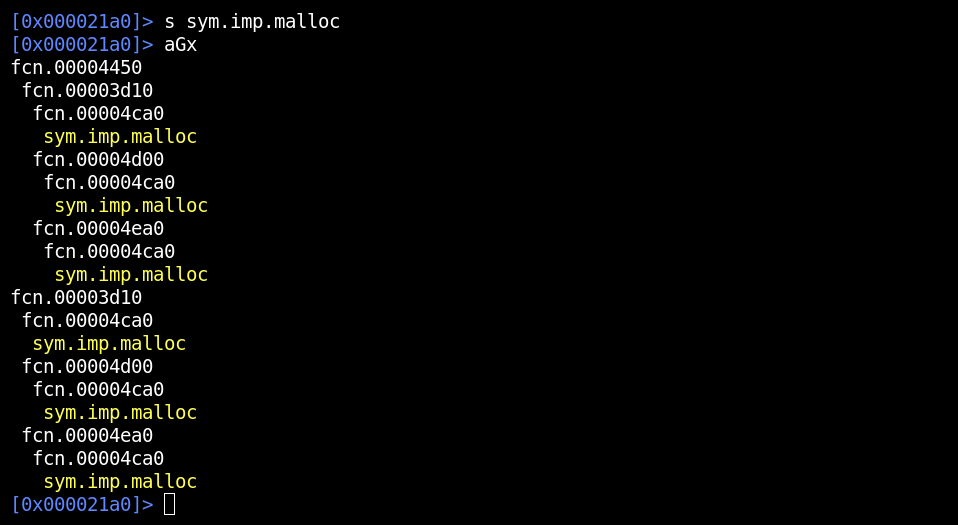
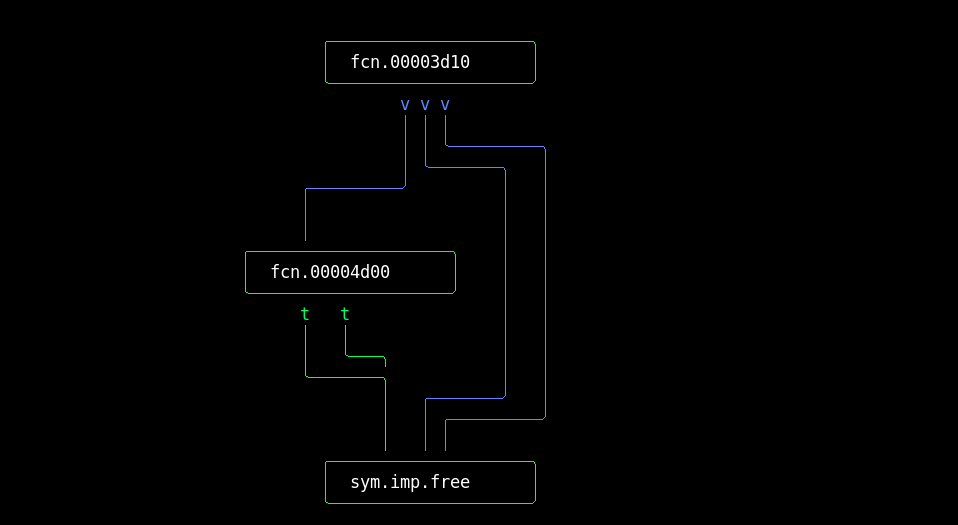
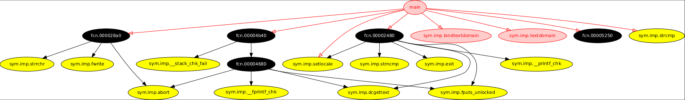
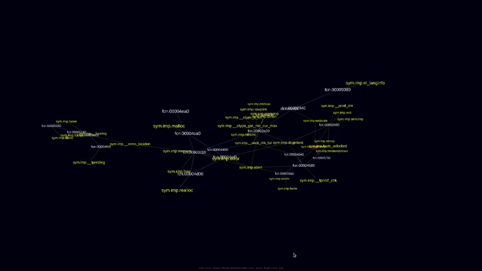

r2graph
=======

Recursive graphs.

	aG

```
Recursive graphs:
aGx[format]     references to current function (Xrefs to graph)
aGc[format]     calls of current function (Xrefs from graph)
aGC[format]     calls of all functions (Global calls graph)

Output formats:
<blank>     simple text
v           interactive ascii art
d           graphviz dot
w           webGL 3D graph
```

### Xrefs to graph:

	aGx - just printing



	aGxv - interactive ascii graph



### Xrefs from graph:

	aGcd - graphviz dot graph



### Global calls graph:

	aGCw - webGL 3D graph


