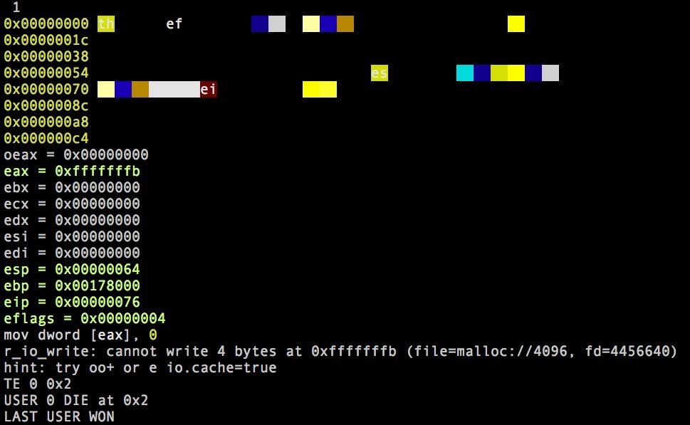

r2wars
======

r2wars is a game similar to [Core War](https://en.wikipedia.org/wiki/Core_War) (or pMARS)

[asciinema demo](https://asciinema.org/a/0zu3d2hlriuhdup8uel4znjtr)

How it works
------------

Core War-style games are basically a competition between two programs to survive as much time as possible by sharing the memory space with other programs.

In Core War or pmars, the code you run is from a specific artificial architecture, the differences with r2wars are the following:

* Use any arch supported by ESIL
* More than 2 programs can run at the same time
* Cyclic execution cost matters for the turns

Two or more programs written in assembly for Z80, MIPS, ARM, X86, are assembled with rasm2 and then emulated using ESIL.

The program counter and stack pointers are initialized at random positions in a common shared memory address space for both programs.

The r2wars scheduler will execute one instruction of each program on each turn, skipping some turns to adjust to the cyclic cost of execution of the specific instruction.

The challenge
-------------

The programs must find in memory the other program and overwrite it in order to make it crash.

A crash happens when the program executes an invalid instruction or tries to read/write in a non-allocated address. Syscalls are ignored, but this may change after some discussion, as well as handling IO and catch unalignment memory accesses.

The memory where those programs run is assumed to be `rwx`.

Multiple techniques are used in order to achieve this:

Your program can try to protect itself by replicating itself on different places and jump there, but you can also use offensive techniques like the one in this example code that aims to identify where the other's program live and nullify its bytes

	call label
	label:
	  pop eax
	loop:
	  sub eax, 10
	  cmp [eax], 0
	je loop
	  mov [eax], 0
	  jmp loop

Side benefits
-------------

Despite of the main benefit of having fun competing with others just writing assembly code, r2wars aims to improve the support for more architectures, by supporting more instructions, better encodings, find and squash bugs in the assembler, enhance the emulation, identify problems in the ESIL emulation engine, etc..

References
----------

* http://www.koth.org/pmars/

Q&A
===

https://hackmd.io/EwM2CNwdgNgUwLRQBwGNkICwGYCc2FwZUBGBEzXTTOABhhKhNyA=

* Where can I find some sample programs to take as a template?

https://github.com/radare/radare2-extras/tree/master/r2wars/t

* How to make awesome warrior that wins r2wars if I'm a n00b?

There are several techniques that may allow your program to survive for more time. Bear in mind that there's no perfect code to win because that will depend on the other player.

* I'm writing a program and seems like is not assembling one instruction properly

r2wars uses rasm2 under the hood to generate binary code. You may use this program to check if the generated code is correct or not.

* Alignment

ARM and MIPS have memory alignment restrictions, so you dont want to run code or access unaligned addresses.

This is pending to be implemented, but will be done before r2con. See those bugs for more details

https://github.com/radare/radare2/labels/r2wars

* How is this code executed?

r2 emulates code using ESIL, it's executed in a turn-based model, Each turn, the r2wars engine will compute the cicles needed to execute the next instruction and will decrement that counter by one and execute it when ready.

This is, instructions accessing memory are slower than the ones just messing with registers.

* Which architectures will be used in the competition?

x86, mips, arm, gb

* That's cool, but which specific models of cpu?

x86: -a x86 -b 32
mips: -a mips -b 32
arm: -a arm -b 64
gb: -a gb -b 8

I think arm64 is better than arm32/16 for the competition, but thumb/arm switches could be really tricky.

* Will x86 programs compete against gb or arm ones?

No, despite being possible, because ESIL abstracts the execution of machine code. But in this tournament we will only make x86 programs fight against other x86 programs, and the same goes for arm, mips and gb.

Maybe this can be an interesting option for next year. But not this time.

* As a n00b should I focus on one arch? 

The aim of this competition is to learn more about those archs, enhance the support for them in assembler and emulation and fun. Pun on this last point. so, having even a basic program for all arches would make the competition more fun. usually x86 is the most common entrypoint for assembler writers.

* How big is the memory?

For now, we will use 1KB, allocated at address 0. Reading or writing beyond those limits will make your program crash

* How big can my program be? 

Both programs should fit in this memory, so, the bigger your program is, the easier to find by the other player.

* Stack and Code share the same address space?

No. Stack is shared btw both program but dont is stored at same address space as code.

But you can use stack-related instructions to peek/poke memory too and try to overwrite enemy stack ... 

At this moment im thinking to increment the memory space and share with stack.

* Warriors Types and how to design it

You dont need have a big notions of asm to made ur own warrior, take in mind the objetives:
   - locate and destroy the enemy
   - survive and wait a enemy error
   - both of them

To acomplish this objetives u only need know a fews instructions, especially those related to memory movements.

* Which kind of programs can we do?

   - rabbit
   - imp
   - bomber 
   - vampire
   - replicator
 
   http://www.pbm.com/~lindahl/pbem_articles/corewars

* How to get the current program counter?

The first thing most programs will do is to locate themselves in memory, but this is not a mandatory requirement.

x86: call me;me:;pop eax
z80: call me;me:;pop bc
arm64: bl, adrp.. but its a pain
mips: blx and then mov t0, ra
arm32: pc is r15 and can be accessed like any other reg
